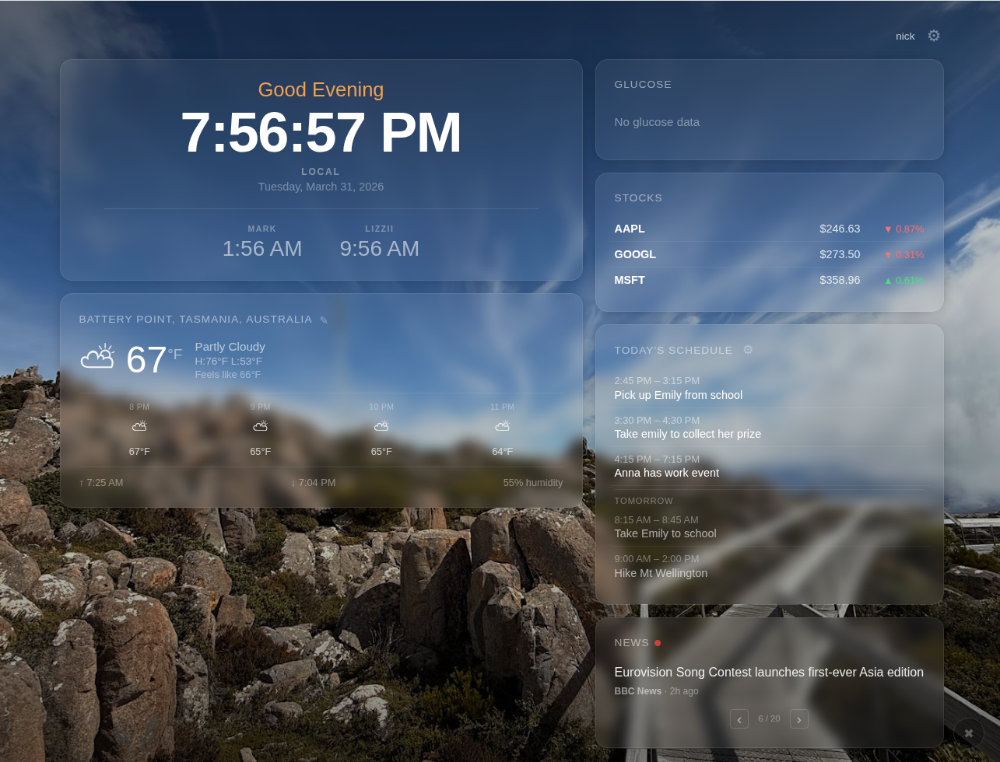

# Good Morning Dashboard

A full-stack web dashboard designed for a tablet display in a living room. Shows at-a-glance information you want to see first thing in the morning: time, weather, stocks, calendar, and news headlines.



## Tech Stack

- **Backend:** Django 5.2 LTS + Django REST Framework + django-allauth (Google OAuth)
- **Frontend:** React 19 + Vite, CSS Modules
- **Database:** PostgreSQL 16 (Docker for dev, native on Pi)
- **Scheduler:** django-apscheduler for periodic data fetching
- **Styling:** CSS Modules, dark gradient theme with glass-morphism cards

## Widgets

| Widget | Data Source | Update Frequency |
|--------|-----------|-----------------|
| Clock | Client-side | Every minute |
| Weather | Open-Meteo API (no key required) | Every 15 minutes |
| Stocks | Finnhub API (free tier) | Every 5 minutes |
| Calendar | Google Calendar API (OAuth) | Every 30 minutes |
| News | RSS feeds (BBC, NPR, Reuters, AP, Ars Technica, Hacker News) | Every 60 minutes |
| Photos | Google Photos Picker API | Configurable (15-300s) |
| Glucose | Dexcom Share API (CGM) | Every 5 minutes |
| Word of the Day | Static JSON dataset (phonics curriculum) | Hourly |

## Layout

Uses a **Hero layout** (60/40 split):
- **Left panel (default):** Clock (multi-timezone: primary + 0-3 configurable aux) and Weather
- **Right panel:** Glucose, Stocks, Calendar, and News stacked vertically

Widget layout is fully configurable — drag-and-drop widgets between panels, reorder, enable/disable via the Settings panel. Touch-friendly drag targets for touchscreen use.

Background photo slideshow from Google Photos with configurable crossfade interval.

**Photo Frame Mode:** Fullscreen photo slideshow with optional dashboard flash — the dashboard appears as a "slide" every N photos for a configurable duration, then fades back to photos.

**Kiosk Mode:** Disables external links so tapping stocks, news, or calendar won't navigate away from the dashboard. Ideal for always-on touchscreen displays.

**News Trawler:** Configurable RSS feeds with Google News keyword search, include/exclude keyword filters, adjustable rotation interval and max headlines — all managed from the Settings panel.

## Quick Start

### Prerequisites
- Docker Desktop (for PostgreSQL)
- Python 3.12+
- Node.js 20+

### One-command setup

```bash
./deploy.sh
```

This starts Docker, installs all dependencies, runs migrations, seeds sample data, and launches all dev servers.

Other deploy commands:

```bash
./deploy.sh --services   # Start PostgreSQL via Docker
./deploy.sh --backend    # Install Python deps, migrate, seed
./deploy.sh --frontend   # npm install
./deploy.sh --start      # Launch all dev servers
./deploy.sh --stop       # Stop all dev servers
./deploy.sh --test       # Start services + run pytest
```

### Manual setup

**Backend:**
```bash
cd backend
python -m venv .venv
source .venv/Scripts/activate    # Windows Git Bash
pip install -r requirements.txt
cp .env.example .env             # Edit with your API keys
python manage.py migrate
python manage.py seed_data       # Creates admin user + sample data
python manage.py runserver
```

**Frontend:**
```bash
cd frontend
npm install
npm run dev
```

**Scheduler (optional, for live data):**
```bash
cd backend
source .venv/Scripts/activate
python manage.py run_scheduler
```

After startup:
- **Dashboard:** http://localhost:5173
- **API:** http://localhost:8000/api/
- **Admin:** http://localhost:8000/admin/ (admin / admin)

### Run Tests
```bash
# Backend (137 tests) — requires PostgreSQL running
cd backend
source .venv/Scripts/activate
python -m pytest -v

# Frontend (88 tests)
cd frontend
npm test
```

## Configuration

Copy `backend/.env.example` to `backend/.env` and configure:

| Variable | Required | Description |
|----------|----------|-------------|
| `SECRET_KEY` | Yes | Django secret key |
| `DEBUG` | No | Default: True |
| `DATABASE_URL` | No | Default: SQLite. Set to `postgres://...` for PostgreSQL |
| `FINNHUB_API_KEY` | For stocks | Free at finnhub.io |
| `WEATHER_LAT` | No | Latitude (default: 40.7128 / NYC) |
| `WEATHER_LON` | No | Longitude (default: -74.0060 / NYC) |
| `GOOGLE_CLIENT_ID` | For Google | Google OAuth client ID |
| `GOOGLE_CLIENT_SECRET` | For Google | Google OAuth client secret |

## API Endpoints

| Endpoint | Method | Description |
|----------|--------|-------------|
| `/api/weather/` | GET | Cached weather data |
| `/api/weather/location/` | POST | Update weather location |
| `/api/stocks/` | GET | Cached stock quotes |
| `/api/calendar/` | GET | Today's calendar events |
| `/api/news/` | GET | Recent news headlines |
| `/api/dashboard/` | GET, PATCH | User dashboard configuration |
| `/api/geocode/` | GET | City search for location picker |
| `/api/auth/status/` | GET | Auth status + CSRF cookie |
| `/api/photos/<index>/` | GET | Photo proxy (Google Photos) |
| `/api/photos/picker/session/` | POST | Create Photos Picker session |
| `/api/photos/picker/session/<id>/poll/` | GET | Poll picker session status |
| `/api/photos/picker/session/<id>/media/` | GET | Fetch picker media items |
| `/api/glucose/` | GET | Current glucose reading + 3hr history |
| `/api/word-of-the-day/` | GET | Today's phonics word + pattern |

## Project Structure

```
goodmorning/
  backend/
    config/                 # Django settings, URLs, WSGI/ASGI
    dashboard/              # Main Django app
      models.py             # UserDashboard, WeatherCache, StockQuote,
                            #   CalendarEvent, NewsHeadline, GlucoseReading
      views.py              # DRF API views (weather, stocks, calendar,
                            #   news, glucose, photos, auth, geocode)
      serializers.py        # DRF serializers + input validation
      urls.py               # API route definitions
      jobs.py               # APScheduler jobs (weather, stocks, news,
                            #   Google Calendar, Google Photos, glucose)
      admin.py              # Django admin registrations
      services/             # External API clients
        weather.py          #   Open-Meteo API
        stocks.py           #   Finnhub API
        news.py             #   RSS feed parser (feedparser)
        google_api.py       #   Google Calendar + Photos Picker APIs
        glucose.py          #   Dexcom Share API (pydexcom)
        geocode.py          #   Open-Meteo geocoding
        _http.py            #   Shared retry/backoff HTTP helper
      management/commands/
        run_scheduler.py    # APScheduler management command
        seed_data.py        # Dev data seeder
        setup_google_oauth.py  # Google OAuth bootstrap
      tests/                # pytest + factory_boy (137 tests)
    manage.py
  frontend/
    src/
      api/                  # Fetch wrappers (weather, stocks, calendar,
                            #   news, glucose, dashboard, auth, geocode)
      hooks/                # TanStack Query hooks (useWeather, useStocks, etc.)
      components/
        Dashboard.jsx       # Main Hero layout (60/40 split)
        BackgroundSlideshow.jsx  # Google Photos crossfade slideshow
        SettingsPanel.jsx   # Settings (layout, kiosk mode, clock, news,
                            #   photos, glucose, Google account)
        AuthStatus.jsx      # Google OAuth status indicator
        WidgetCard.jsx      # Shared glass-morphism card wrapper
        StaleIndicator.tsx  # Data freshness warning icon
        widgets/            # Clock, Weather, Stocks, Calendar, News,
                            #   Glucose, WordOfTheDay, LocationSelector
        widgets/__tests__/  # Component tests (vitest + @testing-library/react)
        mocks/              # Static layout mockups (Grid, Hero, Band, Featured)
  pi/                       # Raspberry Pi deployment configs
    pi-setup.sh             #   First-time Pi bootstrap
    pi-update.sh            #   On-Pi update (deps, migrate, restart)
    pi-health.sh            #   Health check script
    goodmorning-setup.sh    #   SSH key + initial config
  deploy.sh                 # Local dev bootstrap & lifecycle
  deploy-pi.sh              # Dev → Pi deployment (rsync or scp+tar)
  docker-compose.yml        # PostgreSQL 16 (dev)
  docs/
    raspberry-pi-deployment.md  # Pi architecture, setup, troubleshooting
    pi-setup-notes.md           # First-deploy gotchas
```

## Deployment Targets

| Target | Database | Status |
|--------|----------|--------|
| Local Windows + Docker | PostgreSQL 16 | Working |
| Raspberry Pi | PostgreSQL 16 (native) | Working |
| Raspberry Pi + DSI Touchscreen | PostgreSQL 16 (native) | Working |

### Touchscreen / Kiosk Notes

For Raspberry Pi with a DSI touchscreen (e.g., Goodix capacitive):
- Display rotation via kanshi (`transform 270` for landscape)
- Touch-to-output mapping via labwc `rc.xml` (`mapToOutput="DSI-2"`)
- Enable **Kiosk Mode** in Settings to prevent link navigation
- Compact layout auto-applies at 1280x720 (reduced padding, larger fonts)

## Future Work

- Reward chart widget (weekly habit tracker for kids — execution plan in `.tasks/`)
- Privacy Policy page (needed for Google verification)
- In-dashboard detail view (iframe or panel) for stocks/news instead of external links
- PWA support (tablet home screen install)
- Theme customization (dark/light modes)
